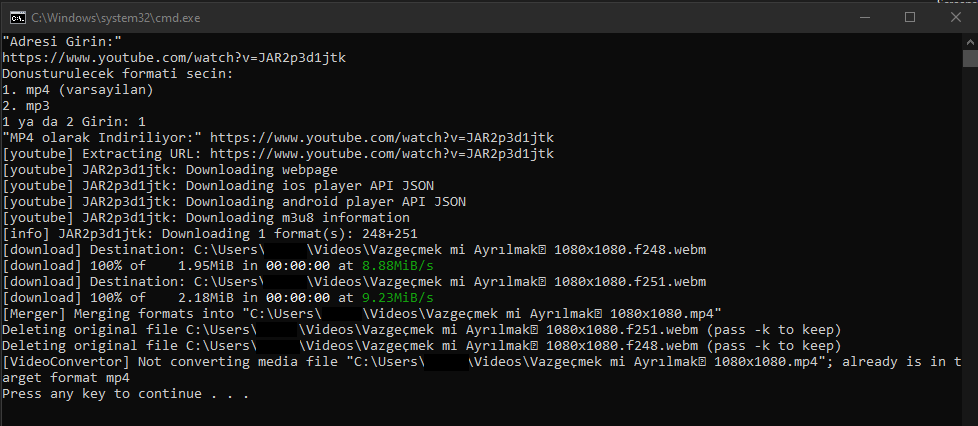

# ytdl-by-kambaabi

Kendi bilgisayarımdan istediğim videoyu indirmek istiyorum, çok mu? :)

yt-dlp'yi kullanarak, windows üzerinde, istediğim sosyal medya videosunu bilgisayarıma indirmek için ayarladığım minik araç.

## Kullanım:

- `çalıştır.bat` dosyasını açıp ilgili url'yi yapıştırıp ENTER'a basın.
- Sonrasında size hangi formatta indirmek istediğinizi soracak. `mp4` için 1'e, `mp3` için 2'ye basın. Hiçbirşey yapmazsanız 1 saniye sonra otomatik olarak mp4 seçeneğini seçmektedir.
- İndirir ve <OTURUM.ADINIZ>\Videolar içerisine kaydedip size bu klasörü otomatik açar.

## Kurulum:

- Öncelikle `çalıştır.bat` dosyasını indirip bir klasöre koyun.
- [yt-dlp releases](https://github.com/yt-dlp/yt-dlp/releases) adresinden yt-dlp.exe'yi indirin ve bat dosyasının yanına koyun.
  
- gyan ffmpeg builds sitesinden full build'i indirin, zip'i açın ve bin klasörü içindeki 3 dosyayı çalıştır.bat dosyasının yanına koyun.
  
- İndirilen dosyalarla birlikte aşağıdaki resimdeki gibi olunca, kullanıma hazırsınız.
  
